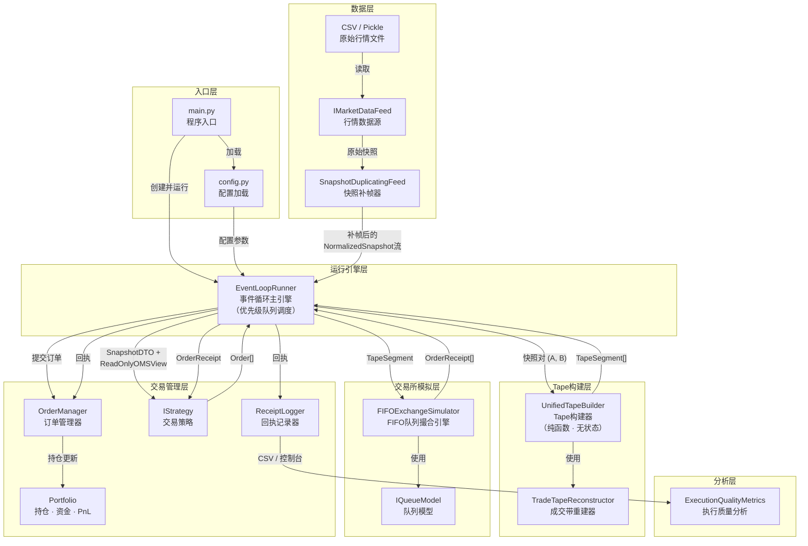
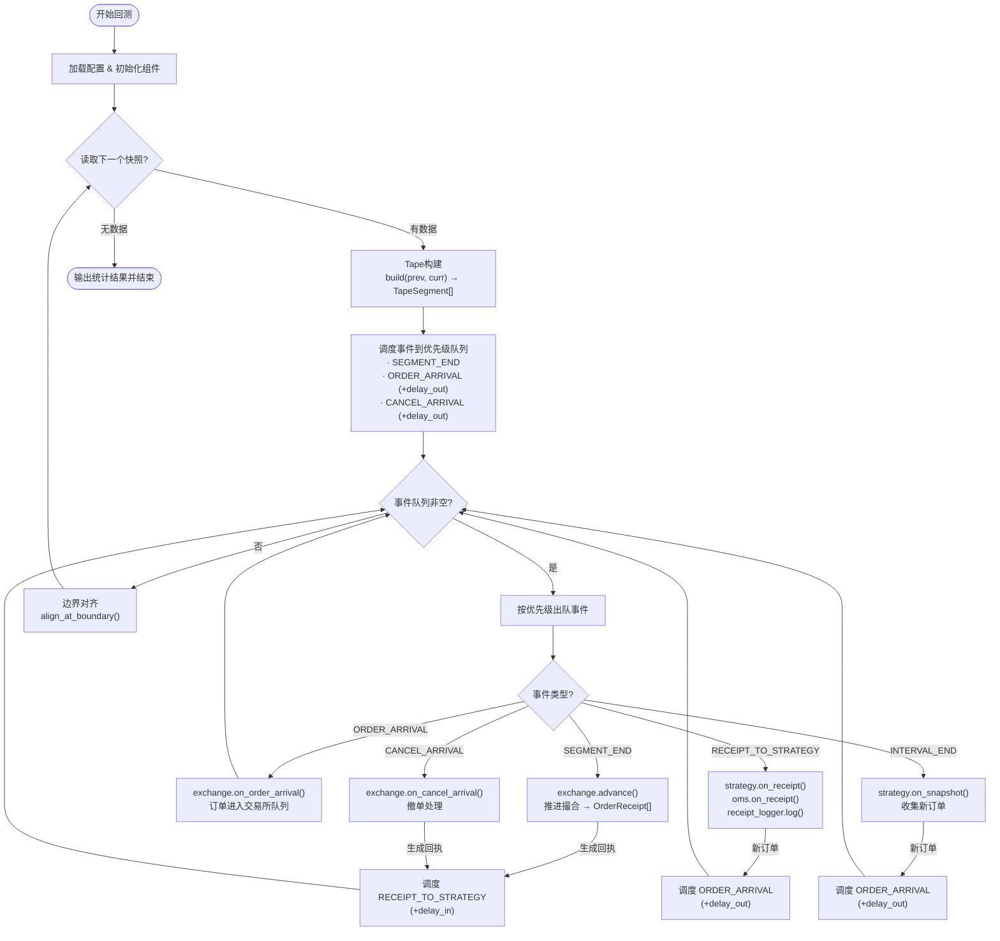
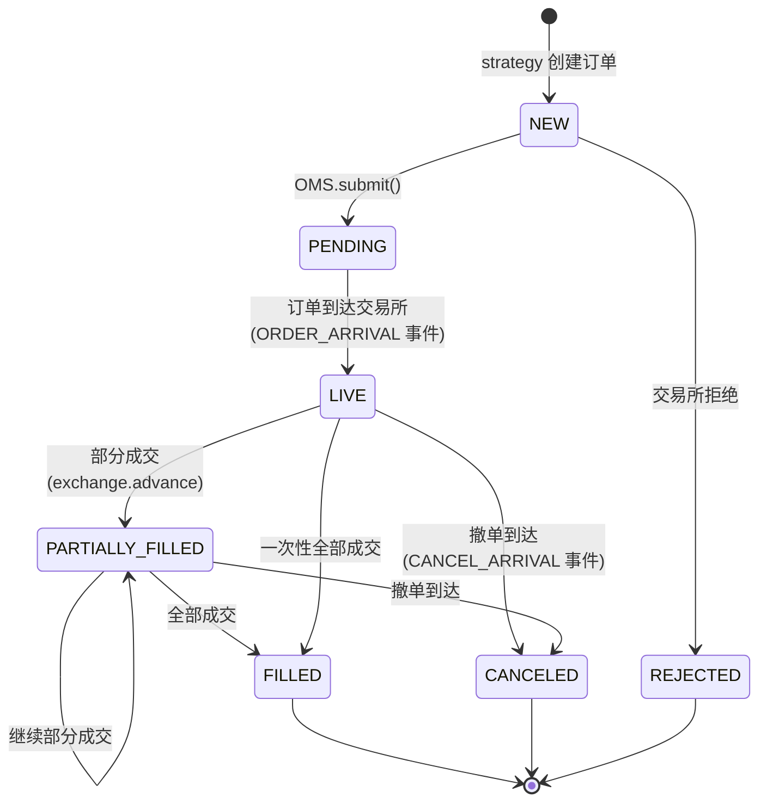
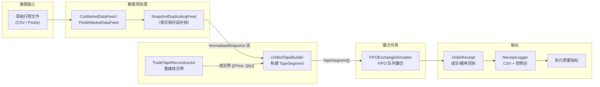
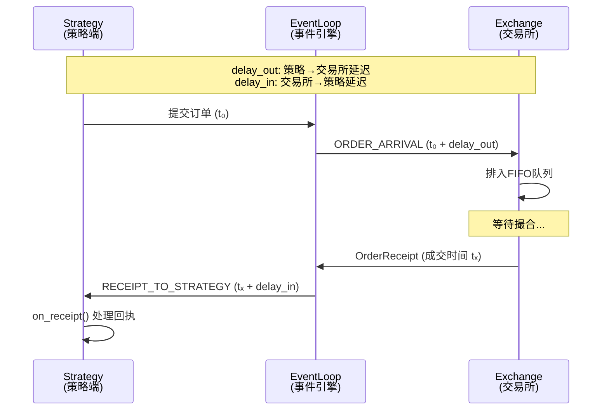
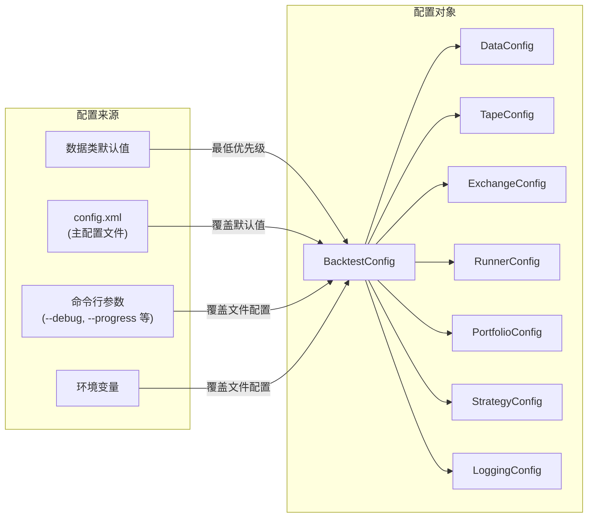

# BackTestSys 系统设计图

本文档描述回测系统的整体架构设计，包括模块结构、组件交互、数据流和订单生命周期。

---

## 1. 系统模块总览

```
quant_framework/
├── core/               # 核心抽象层：类型、接口、事件、DTO
│   ├── types.py            # 基础类型与数据结构
│   ├── interfaces.py       # 8大核心接口定义
│   ├── events.py           # 仿真事件类型
│   ├── dto.py              # 数据传输对象 (SnapshotDTO, ReadOnlyOMSView)
│   ├── data_loader.py      # 行情数据加载器 (CSV / Pickle / 补帧)
│   └── trading_hours.py    # 交易时段辅助
├── tape/               # Tape构建层
│   └── builder.py          # UnifiedTapeBuilder — 从快照重建执行路径
├── market/             # 行情结构层
│   ├── book.py             # BookView — 订单簿视图
│   └── tape.py             # TradeTapeReconstructor — 成交带重建
├── exchange/           # 交易所模拟层
│   └── simulator.py        # FIFOExchangeSimulator — FIFO队列撮合引擎
├── trading/            # 交易管理层
│   ├── oms.py              # OrderManager + Portfolio — 订单与持仓管理
│   ├── strategy.py         # SimpleStrategy — 策略基类
│   ├── replay_strategy.py  # ReplayStrategy — 历史订单回放策略
│   └── receipt_logger.py   # ReceiptLogger — 回执记录与诊断
├── runner/             # 运行引擎层
│   └── event_loop.py       # EventLoopRunner — 事件循环主引擎
├── analysis/           # 分析层
│   └── metrics.py          # ExecutionQualityMetrics — 执行质量指标
└── config.py           # 配置管理 (XML / YAML / JSON)
```

---

## 2. 核心组件架构图



---

## 3. 核心接口关系图

```mermaid
classDiagram
    class IMarketDataFeed {
        <<interface>>
        +next() NormalizedSnapshot?
        +reset()
    }

    class ITapeBuilder {
        <<interface>>
        +build(prev, curr) List~TapeSegment~
    }

    class ITradeTapeReconstructor {
        <<interface>>
        +reconstruct(prev, curr) List~Tuple~
    }

    class IExchangeSimulator {
        <<interface>>
        +reset()
        +on_order_arrival(order, time, qty) OrderReceipt?
        +on_cancel_arrival(order_id, time) OrderReceipt
        +advance(t_from, t_to, segment) Tuple
        +align_at_boundary(snapshot)
        +get_queue_depth(side, price) Qty
    }

    class IQueueModel {
        <<interface>>
        +init_order(order, level_qty)
        +advance_on_trade(order, px, qty, before, after) Qty
        +advance_on_quote(order, before, after)
    }

    class IStrategy {
        <<interface>>
        +on_snapshot(snapshot_dto, oms_view) List~Order~
        +on_receipt(receipt, snapshot_dto, oms_view) List~Order~
    }

    class IOrderManager {
        <<interface>>
        +submit(order, time)
        +on_receipt(receipt)
        +get_active_orders() List~Order~
        +get_order(id) Order?
        +get_pending_orders() List~Order~
        +get_arrived_orders() List~Order~
        +mark_order_arrived(id, time)
    }

    class EventLoopRunner {
        -feed: IMarketDataFeed
        -tape_builder: ITapeBuilder
        -exchange: IExchangeSimulator
        -strategy: IStrategy
        -oms: IOrderManager
        +run() dict
    }

    class UnifiedTapeBuilder {
        -trade_reconstructor: ITradeTapeReconstructor
    }

    class FIFOExchangeSimulator {
        -queue_model: IQueueModel
    }

    EventLoopRunner --> IMarketDataFeed : 使用
    EventLoopRunner --> ITapeBuilder : 使用
    EventLoopRunner --> IExchangeSimulator : 使用
    EventLoopRunner --> IStrategy : 使用
    EventLoopRunner --> IOrderManager : 使用
    UnifiedTapeBuilder ..|> ITapeBuilder : 实现
    UnifiedTapeBuilder --> ITradeTapeReconstructor : 使用
    FIFOExchangeSimulator ..|> IExchangeSimulator : 实现
    FIFOExchangeSimulator --> IQueueModel : 使用
```



---

## 4. 事件循环处理流程



---

## 5. 订单生命周期



---

## 6. 数据流水线



---

## 7. 事件优先级

| 优先级 | 事件类型 | 说明 |
|:---:|:---|:---|
| 1 | `SEGMENT_END` | 段结束 — 先完成内部撮合 |
| 2 | `ORDER_ARRIVAL` | 订单到达交易所 |
| 3 | `CANCEL_ARRIVAL` | 撤单到达交易所 |
| 4 | `RECEIPT_TO_STRATEGY` | 回执到达策略 |
| 5 | `INTERVAL_END` | 区间结束 — 边界对齐与快照回调 |

---

## 8. 双时间线与延迟模型



---

## 9. 配置体系



---

## 10. 关键设计原则

| 设计原则 | 说明 |
|:---|:---|
| **事件驱动架构** | 优先级队列调度，精确模拟时序 |
| **DTO模式** | SnapshotDTO / ReadOnlyOMSView 隔离策略与内部状态 |
| **纯函数Tape构建** | 相同输入 → 相同输出，便于测试和调试 |
| **接口驱动** | 8大抽象接口实现松耦合 |
| **关注点分离** | 数据源 → Tape → 交易所 → OMS → 日志，职责明确 |
| **只读视图** | ReadOnlyOMSView 防止策略意外修改系统状态 |
| **双时间线** | exchtime / recvtime 独立建模，真实反映延迟 |
