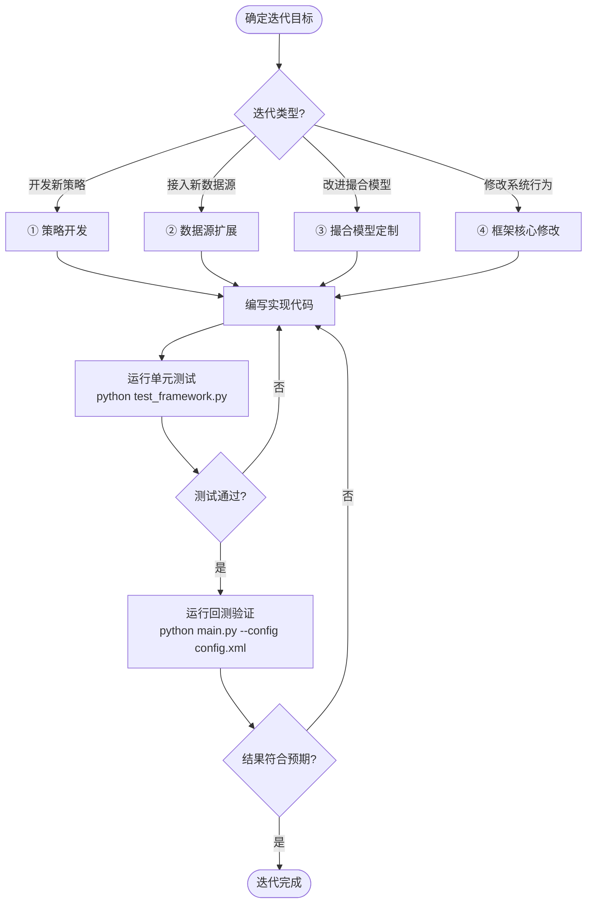
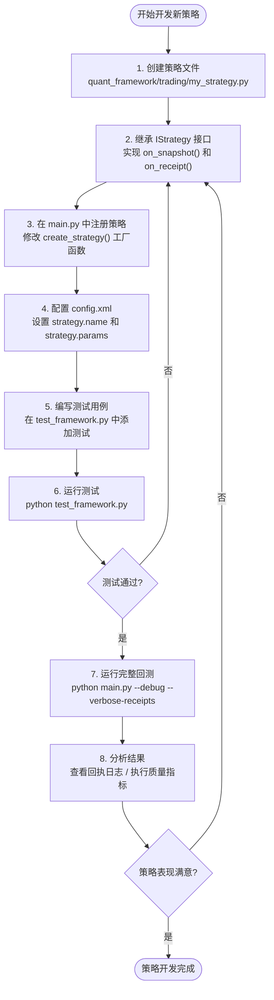
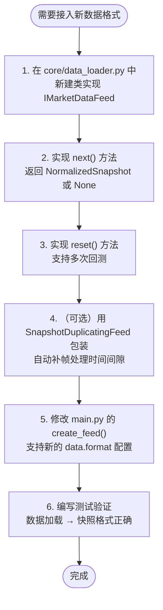
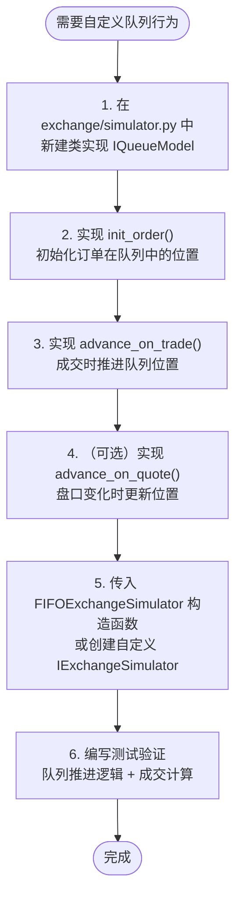
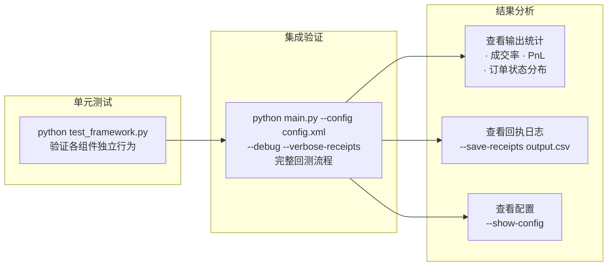

# BackTestSys 系统设计图

本文档描述回测系统的整体架构设计，包括模块结构、组件交互、数据流和订单生命周期。

---

## 1. 系统模块总览

```
quant_framework/
├── core/               # 核心抽象层：类型、接口、事件、DTO
│   ├── types.py            # 基础类型与数据结构
│   ├── interfaces.py       # 8大核心接口定义
│   ├── events.py           # 仿真事件类型
│   ├── dto.py              # 数据传输对象 (SnapshotDTO, ReadOnlyOMSView)
│   ├── data_loader.py      # 行情数据加载器 (CSV / Pickle / 补帧)
│   └── trading_hours.py    # 交易时段辅助
├── tape/               # Tape构建层
│   └── builder.py          # UnifiedTapeBuilder — 从快照重建执行路径
├── market/             # 行情结构层
│   ├── book.py             # BookView — 订单簿视图
│   └── tape.py             # TradeTapeReconstructor — 成交带重建
├── exchange/           # 交易所模拟层
│   └── simulator.py        # FIFOExchangeSimulator — FIFO队列撮合引擎
├── trading/            # 交易管理层
│   ├── oms.py              # OrderManager + Portfolio — 订单与持仓管理
│   ├── strategy.py         # SimpleStrategy — 策略基类
│   ├── replay_strategy.py  # ReplayStrategy — 历史订单回放策略
│   └── receipt_logger.py   # ReceiptLogger — 回执记录与诊断
├── runner/             # 运行引擎层
│   └── event_loop.py       # EventLoopRunner — 事件循环主引擎
├── analysis/           # 分析层
│   └── metrics.py          # ExecutionQualityMetrics — 执行质量指标
└── config.py           # 配置管理 (XML / YAML / JSON)
```

---

## 2. 核心组件架构图


---

## 3. 核心接口关系图

```mermaid
classDiagram
    class IMarketDataFeed {
        <<interface>>
        +next() NormalizedSnapshot?
        +reset()
    }

    class ITapeBuilder {
        <<interface>>
        +build(prev, curr) List~TapeSegment~
    }

    class ITradeTapeReconstructor {
        <<interface>>
        +reconstruct(prev, curr) List~Tuple~
    }

    class IExchangeSimulator {
        <<interface>>
        +reset()
        +on_order_arrival(order, time, qty) OrderReceipt?
        +on_cancel_arrival(order_id, time) OrderReceipt
        +advance(t_from, t_to, segment) Tuple
        +align_at_boundary(snapshot)
        +get_queue_depth(side, price) Qty
    }

    class IQueueModel {
        <<interface>>
        +init_order(order, level_qty)
        +advance_on_trade(order, px, qty, before, after) Qty
        +advance_on_quote(order, before, after)
    }

    class IStrategy {
        <<interface>>
        +on_snapshot(snapshot_dto, oms_view) List~Order~
        +on_receipt(receipt, snapshot_dto, oms_view) List~Order~
    }

    class IOrderManager {
        <<interface>>
        +submit(order, time)
        +on_receipt(receipt)
        +get_active_orders() List~Order~
        +get_order(id) Order?
        +get_pending_orders() List~Order~
        +get_arrived_orders() List~Order~
        +mark_order_arrived(id, time)
    }

    class EventLoopRunner {
        -feed: IMarketDataFeed
        -tape_builder: ITapeBuilder
        -exchange: IExchangeSimulator
        -strategy: IStrategy
        -oms: IOrderManager
        +run() dict
    }

    class UnifiedTapeBuilder {
        -trade_reconstructor: ITradeTapeReconstructor
    }

    class FIFOExchangeSimulator {
        -queue_model: IQueueModel
    }

    EventLoopRunner --> IMarketDataFeed : 使用
    EventLoopRunner --> ITapeBuilder : 使用
    EventLoopRunner --> IExchangeSimulator : 使用
    EventLoopRunner --> IStrategy : 使用
    EventLoopRunner --> IOrderManager : 使用
    UnifiedTapeBuilder ..|> ITapeBuilder : 实现
    UnifiedTapeBuilder --> ITradeTapeReconstructor : 使用
    FIFOExchangeSimulator ..|> IExchangeSimulator : 实现
    FIFOExchangeSimulator --> IQueueModel : 使用
```



---

## 4. 事件循环处理流程


---

## 5. 订单生命周期


---

## 6. 数据流水线


---

## 7. 事件优先级

| 优先级 | 事件类型 | 说明 |
|:---:|:---|:---|
| 1 | `SEGMENT_END` | 段结束 — 先完成内部撮合 |
| 2 | `ORDER_ARRIVAL` | 订单到达交易所 |
| 3 | `CANCEL_ARRIVAL` | 撤单到达交易所 |
| 4 | `RECEIPT_TO_STRATEGY` | 回执到达策略 |
| 5 | `INTERVAL_END` | 区间结束 — 边界对齐与快照回调 |

---

## 8. 双时间线与延迟模型


---

## 9. 配置体系


---

## 10. 关键设计原则

| 设计原则 | 说明 |
|:---|:---|
| **事件驱动架构** | 优先级队列调度，精确模拟时序 |
| **DTO模式** | SnapshotDTO / ReadOnlyOMSView 隔离策略与内部状态 |
| **纯函数Tape构建** | 相同输入 → 相同输出，便于测试和调试 |
| **接口驱动** | 8大抽象接口实现松耦合 |
| **关注点分离** | 数据源 → Tape → 交易所 → OMS → 日志，职责明确 |
| **只读视图** | ReadOnlyOMSView 防止策略意外修改系统状态 |
| **双时间线** | exchtime / recvtime 独立建模，真实反映延迟 |

---

## 11. 开发迭代流程

### 11.1 总体开发流程



---

### 11.2 策略开发流程（最常见的迭代场景）



**策略接口说明：**

```python
# quant_framework/trading/my_strategy.py
from typing import List
from quant_framework.core.interfaces import IStrategy
from quant_framework.core.types import Order, Side, OrderReceipt
from quant_framework.core.dto import SnapshotDTO, ReadOnlyOMSView

class MyStrategy(IStrategy):
    def on_snapshot(self, snapshot: SnapshotDTO, oms_view: ReadOnlyOMSView) -> List[Order]:
        """每次收到行情快照时调用。
        
        可用数据：
        - snapshot.best_bid / snapshot.best_ask  → 最优买卖价
        - snapshot.bids / snapshot.asks           → 多档盘口
        - snapshot.ts_recv                        → 接收时间戳
        - oms_view.get_active_orders()            → 当前活跃订单
        - oms_view.get_portfolio()                → 持仓和资金
        
        返回值：要提交的新订单列表（空列表 = 不操作）
        """
        ...

    def on_receipt(self, receipt: OrderReceipt, snapshot: SnapshotDTO,
                   oms_view: ReadOnlyOMSView) -> List[Order]:
        """每次收到订单回执（成交/撤单/拒绝）时调用。
        
        可用数据：
        - receipt.receipt_type  → "FILL" / "PARTIAL" / "CANCELED" / "REJECTED"
        - receipt.fill_qty      → 本次成交数量
        - receipt.fill_price    → 成交价格
        
        返回值：要提交的新订单列表
        """
        ...
```

---

### 11.3 各迭代场景速查表

| 迭代目标 | 需要修改的文件 | 涉及的接口 | 注册/接入方式 |
|:---|:---|:---|:---|
| **新增交易策略** | `trading/my_strategy.py` (新建) | `IStrategy` | 修改 `main.py` 中 `create_strategy()` |
| **接入新数据格式** | `core/data_loader.py` (新增类) | `IMarketDataFeed` | 修改 `main.py` 中 `create_feed()` |
| **自定义队列模型** | `exchange/simulator.py` (新增类) | `IQueueModel` | 修改 `main.py` 中 `create_exchange()` |
| **修改Tape构建逻辑** | `tape/builder.py` | `ITapeBuilder` | 修改 `main.py` 中 `create_tape_builder()` |
| **新增成交带重建器** | `market/tape.py` (新增类) | `ITradeTapeReconstructor` | 传入 `UnifiedTapeBuilder` 构造函数 |
| **调整配置参数** | `config.xml` | 无需代码修改 | 直接编辑配置文件或使用命令行覆盖 |
| **新增分析指标** | `analysis/metrics.py` | 无固定接口 | 在回测结束后处理结果 |
| **调整回测参数** | 命令行 | — | `--debug` / `--progress` / `--data` 等 |

---

### 11.4 数据源扩展流程



**NormalizedSnapshot 必须包含的字段：**

```python
NormalizedSnapshot(
    ts_recv=...,          # 接收时间 (tick)
    ts_exch=...,          # 交易所时间 (tick, 可选)
    bids=[(price, qty)],  # 买盘列表 (Level)
    asks=[(price, qty)],  # 卖盘列表 (Level)
    last=...,             # 最新价 (可选)
    volume=...,           # 累计成交量 (可选)
    turnover=...,         # 累计成交额 (可选)
    last_vol_split=...,   # 分价位成交量 (可选)
)
```

---

### 11.5 撮合模型定制流程



---

### 11.6 测试与验证流程



**常用验证命令：**

```bash
# 运行单元测试
python test_framework.py

# 查看当前配置（不执行回测）
python main.py --show-config

# 带调试信息运行回测
python main.py --config config.xml --debug --progress

# 输出详细回执到控制台
python main.py --verbose-receipts

# 保存回执到文件
python main.py --save-receipts output/receipts.csv

# 指定数据文件运行
python main.py --data path/to/market_data.pkl
```

---

### 11.7 迭代开发检查清单

开发新功能时，按以下清单逐步验证：

- [ ] **接口一致性** — 新组件是否正确实现了对应接口的所有方法？
- [ ] **DTO隔离** — 策略是否只通过 SnapshotDTO / ReadOnlyOMSView 访问数据？
- [ ] **工厂注册** — main.py 中的工厂函数是否已更新？
- [ ] **配置支持** — 新参数是否已添加到 config.py 的数据类中？
- [ ] **单元测试** — 是否在 test_framework.py 中添加了对应测试？
- [ ] **回测验证** — 完整回测是否能正常运行并输出合理结果？
- [ ] **文档更新** — ARCHITECTURE.md 和 CONFIG.md 是否已同步更新？
